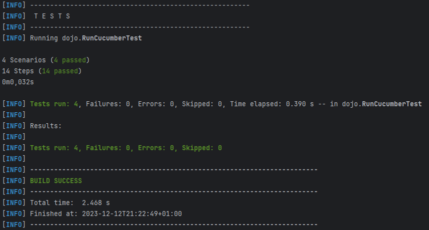
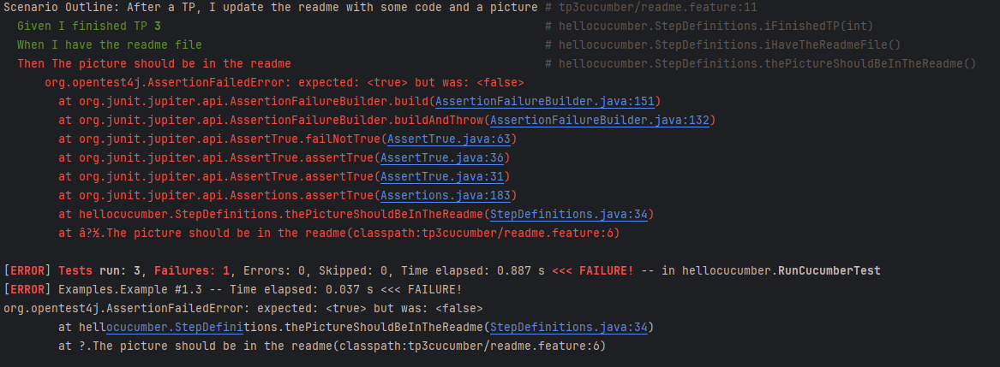
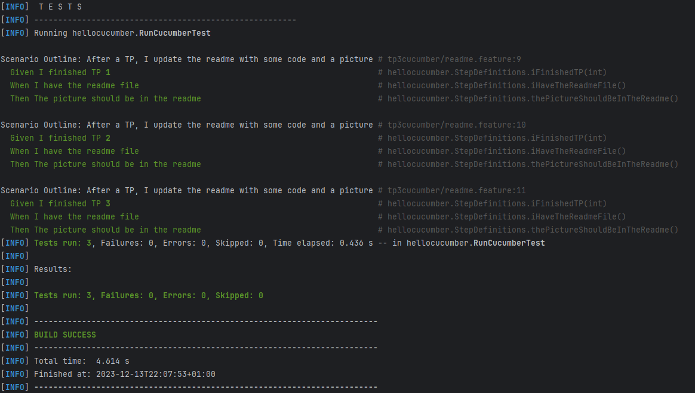

= R5.A.08 -- Dépôt pour les TPs
:icons: font
:MoSCoW: https://fr.wikipedia.org/wiki/M%C3%A9thode_MoSCoW[MoSCoW]

Ce dépôt concerne les rendus de mailto:aurelien.sanchez-porro@etu.univ-tlse2.fr[Aurélien Sanchez-Porro].

== TP1

.Exemple de code
[source,java]
---
@When("I ask whether it's Friday yet")
public void i_ask_wether_its_friday_yet(){
    this.answer = IsItFriday.isItFriday(this.day);
}
---

.Résultat à la fin de la séance
image::images/tp1_result.png[width=80%]

== TP2...

.Code de la classe "Order"
[source,java]
----
package dojo;

import java.util.*;

public class Order {

    private String owner;
    private String target;

    public void declareOwner(String romeo) {
        this.owner = romeo;
    }

    public void declareTarget(String juliette) {
        this.target = juliette;
    }

    public String getOwner() {
        return owner;
    }

    public String getTarget() {
        return target;
    }

    public List<String> getCocktails() {
        return new ArrayList<>();
    }
    
}
----

.Résultat à la fin de la séance

== TP3 (java)

Pour ce 3ème TP, j'ai fait des tests pour vérifier si une image est présente pour le compte rendu d'un TP dans ce fichier README.
Au départ, j'avais prévu aussi de vérifier la présence de code, mais cette idée n'a pas été retenue.

.Résultat lorsque l'image du TP 3 n'est pas présente

.Résultat après avoir ajouté l'image précédente

Cependant, un des défauts de ces tests est qu'il suffit que je nomme l'image du compte rendu d'une manière différente que j'ai fait jusqu'a présent pour que le test ne passe plus.

.Feature "readme.feature"
[source,feature]
----
Feature: Checking if the readme is working

 Scenario Outline: After a TP, I update the readme with some code and a picture
   Given I finished TP <nTP>
   When I have the readme file
   Then The picture should be in the readme
   Examples:
     | nTP        |
     | 1          |
     | 2          |
     | 3          |

----

.Code de la classe "StepDefinitions"
[source,java]
----
public class StepDefinitions {

    private int nTP;

    String content;

    File readme;

    @Given("I finished TP {int}")
    public void iFinishedTP(int tp) {
        this.nTP = tp; //get the tp number
    }

    @When("I have the readme file")
    public void iHaveTheReadmeFile() throws IOException {
        this.readme = new File("../README.adoc");
        this.content = FileUtils.readFileToString(this.readme, "UTF-8");
        //get the "README.adoc" file, and put it in "content"
    }

    @Then("The picture should be in the readme")
    public void thePictureShouldBeInTheReadme() {
        String imageUrl = "images/tp"+ nTP + "_result.png";

        assertTrue(content.contains(imageUrl));
        //check if there is the picture in the content
    }
}

----