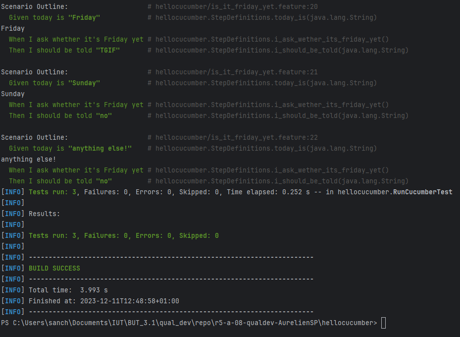

= R5.A.08 -- Dépôt pour les TPs
:icons: font
:MoSCoW: https://fr.wikipedia.org/wiki/M%C3%A9thode_MoSCoW[MoSCoW]

Ce dépôt concerne les rendus de mailto:aurelien.sanchez-porro@etu.univ-tlse2.fr[Aurélien Sanchez-Porro].

== TP1

.Exemple de code
[source,java]
---
@When("I ask whether it's Friday yet")
public void i_ask_wether_its_friday_yet(){
    this.answer = IsItFriday.isItFriday(this.day);
}
---

.Résultat à la fin de la séance

== TP2...
